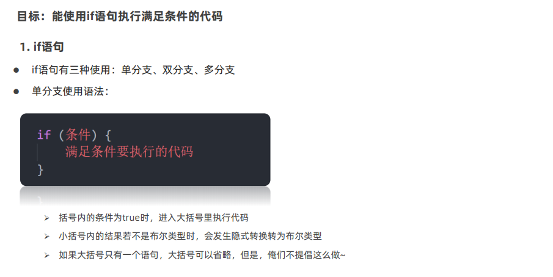
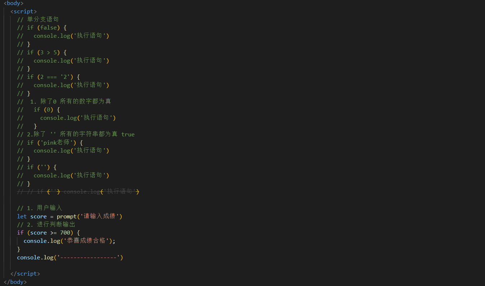

# JavaScript基础-第2天

## 流程控制

### 赋值运算符

### 一元运算符

### 比较运算符

### 逻辑运算符

### 运算符优先级

## 语句

### 表达式和语句

### 分支语句

#### if分支语句

##### if语句

##### 双分支if语句

##### 多分支if语句

#### 三元运算符

 

#### switch语句

### 循环语句

## 综合案例

