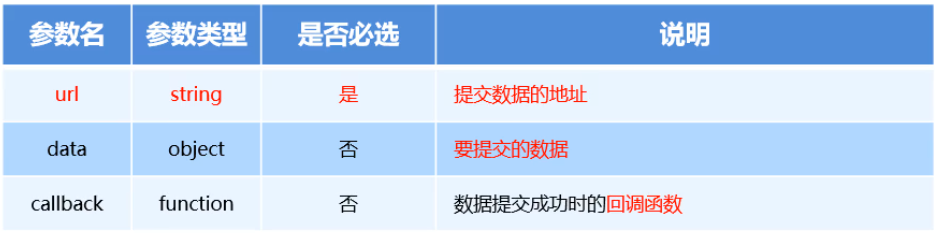
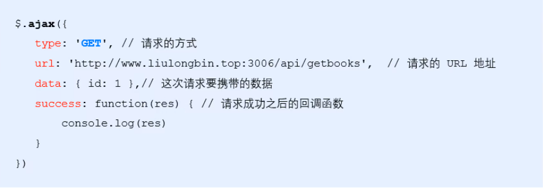
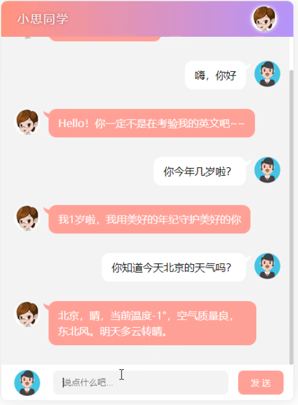

# 相关概念

## 客户端与服务器

### 服务器

上网过程中，负责 **存放和对外提供资源** 的电脑，叫做服务器


### 客户端

在上网过程中，负责 **获取和消费资源** 的电脑，叫做客户端


**举例**：

比如，你通过浏览器看百度的网页：

你的电脑就是**客户端**，浏览器就是客户端程序；

而存放百度网页的机器（电脑）就是**服务器**，百度网页就是服务器端程序。


再比如，你使用QQ聊天：

你的电脑还是**客户端**，QQ就是客户端程序；

腾讯机房中的电脑就是**服务器**，腾讯机房放的存储和交换聊天信息的程序就是服务器端程序。


注：我们在自己的电脑上做网站，调试网站：我们的电脑即充当客户端又充当服务器端


## URL地址的概念&组成

### URL的概念

URL（全称是 `UniformResourceLocator`） 中文叫 **统一资源定位符**，用于标识互联网上每个资源的唯一存放位置。浏览器只有通过URL地址，才能正确定位资源的存放位置，从而成功访问到对应的资源——简单地说，URL就是Web地址，俗称“网址”。

### URL的组成

URL地址一般由三部分组成:

- 客户端与服务器之间的 **通信协议**（http、https（http的安全版））
- 存有该资源的 **服务器名称**
- 资源在服务器上 **具体的存放位置**

更详细的组成：https://developer.mozilla.org/zh-CN/docs/Learn/Common_questions/What_is_a_URL


## 客户端与服务器通讯过程（⭐⭐⭐）

客户端与服务器之间的通讯过程，分为： **请求-处理-响应** 三个步骤

网页中每一个资源，都是通过 **请求-处理-响应** 的方式从服务器获取回来的


## 基于浏览器工具分析通讯过程


**步骤：**

- 打开`Chorme`浏览器
- `Ctrl + Shift + I（F12）` 打开 Chrome 的开发者工具
- 切换到 `Network` 面板
- 选中`Doc` 页签
- 刷新页面，分析客户端与服务器的通讯过程


## 网页中如何请求数据

> 数据，也是服务器对外提供的一种 资源，只要是资源，必然要通过 请求 - 处理 - 响应 的方式进行获取


如果要在网页中请求服务器上的数据资源，需要用到 `XMLHttpRequest` 对象（ajax的核心）

`XMLHttpRequest`（简称 `xhr`）是浏览器提供的`JS`成员，通过它，可以请求服务器上的数据资源

最简单的用法 `var xhrObj = new XMLHttpRequest()`；


为什么不用原生的`XMLHttpRequest`，要用ajax：https://blog.csdn.net/weixin_45846357/article/details/106606007

## 资源的请求方式

客户端请求服务器时，请求的方式 **有很多种**，最常见的两种请求方式分别是 `get` 和 `post` 请求

- `get 请求`，通常用于 **获取服务器资源**（要资源）

  例如：根据 `URL` 地址，从服务器获取 `HTML`文件、`css`文件、`js`文件、图片文件、数据资源等

- `post 请求`，通常用于 **向服务器提交数据**（送资源）

  例如：登录时，向服务器 **提交登录信息**、注册时向服务器 **提交注册信息**、添加用户时向服务器 **提交用户信息**等各种 **数据提交操作**
  
  
  
  扩展（了解）：https://www.runoob.com/tags/html-httpmethods.html

# 了解`Ajax`

## 什么是`Ajax`（⭐⭐⭐）

概念：**AJAX 是一种从网页访问 Web 服务器进行数据交换的技术。**

AJAX = *A*synchronous *J*avaScript *A*nd *X*ML（异步 `JavaScript` 和 `xml`）。即：使用Javascript语言与服务器进行异步交互，传输的数据为XML（当然，传输的数据不只是XML）。

- 同步交互：客户端发出一个请求后，需要等待服务器响应结束后，才能发出第二个请求；
- 异步交互：客户端发出一个请求后，无需等待服务器响应结束，就可以发出第二个请求。

AJAX 并非编程语言。

AJAX 仅仅组合了：

- 浏览器内建的 XMLHttpRequest 对象（从 web 服务器请求数据）
- JavaScript 和 HTML DOM（显示或使用数据）

看看廖雪峰大佬怎么说的：https://www.liaoxuefeng.com/wiki/1022910821149312/1023022332902400

## AJAX 如何工作


1. 网页中发生一个事件（页面加载、按钮点击）
2. 由 JavaScript 创建 XMLHttpRequest 对象
3. XMLHttpRequest 对象向 web 服务器发送请求
4. 服务器处理该请求
5. 服务器将响应发送回网页
6. 由 JavaScript 读取响应
7. 由 JavaScript 执行正确的动作（比如更新页面）

## `Ajax`应该用场景（⭐⭐⭐）

#### 场景一：用户名检测

注册用户时，通过 `ajax` 的形式，动态 **检测用户名是否被占用**


实现原理（仅了解）：

当输入用户名后，把光标移动到其他表单项上时，浏览器会使用AJAX技术向服务器发出请求，服务器会查询名为zhangSan的用户是否存在，最终服务器返回true表示名为zhangSan的用户已经存在了，浏览器在得到结果后显示“用户名已被注册！”。

#### 场景二：搜索提示

当输入搜索关键字时，通过 `ajax` 的形式，动态 **加载搜索提示列表**


实现思路（仅了解，后面会带大家写）：

- 当输入框输入变化时，浏览器会使用AJAX技术向服务器发送一个请求，查询包含“老师”的前几个关键字，然后服务器会把查询到的结果响应给浏览器，最后浏览器把这几个关键字显示在下拉列表中。
- 整个过程中页面没有刷新，只是刷新页面中的局部位置而已！
- 当请求发出后，浏览器还可以进行其他操作，无需等待服务器的响应！ 

#### 场景三：数据分页显示

当点击页码值得时候，通过 `ajax` 的形式，**根据页码值动态刷新表格的数据**


#### 场景四：数据的增删改查

数据的添加、删除、修改、查询操作，都需要通过 `ajax` 的形式，来实现数据的交互


# `jQuery`中的Ajax

浏览器中提供的 `XMLHttpRequest` 用法比较复杂，所以 `jQuery` 对 `XMLHttpRequest` 进行了封装，提供了一系列Ajax相关的函数，极大地 **降低了Ajax的使用难度**

`jQuery`中发起 Ajax 请求最常用的三个方法如下：

- `$.get()` get方式请求，用于获取数据
- `$.post()` post方式请求，用于提交数据
- `$.ajax()` 比较综合，既可以获取数据，又可以提交数据

## $.get() 函数介绍（⭐⭐）

`jQuery` 中 `$.get()` 函数的功能单一，专门用来发起 `get` 请求，从而将服务器上的资源请求到客户端来进行使用

```javascript
$.get(url,[data],[callback])
```


### $.get()发起不带参数的请求

使用 $.get() 函数 发起不带参数的请求时，直接提供给 **请求的 URL 地址** 和 **请求成功之后的回调函数** 即可，示例代码如下


### $.get()发起携带参数的请求

使用`$.get()` 发起携带参数的请求，那么携带的参数应该写在第二个参数的位置，示例代码如下：


## $.post() 函数介绍（⭐⭐）

`jQuery` 中 `$.post()` 函数的功能单一，专门用来发起`post`请求，从而向服务器提交数据

`$.post()` 函数的语法如下：

```javascript
$.post(url,[data],[callback])
```

参数各自代表的含义如下：



### $.post() 向服务器提交数据

使用 `$.post()` 向服务器提交数据的示例代码如下：


## `$.ajax()` 函数介绍（⭐⭐⭐）

相比于 `$.get()` 和 `$.post()` 函数，`jQuery` 中提供的 `$.ajax()` 函数，是一个功能比较综合的函数，它允许我们对 `Ajax` 请求进行更详细的配置。

`$.ajax()` 函数的基本语法如下：


### `$.ajax()` 发起 get 请求

使用 `$.ajax()` 发起 `GET` 请求时，只需要将 `type` 属性 的值设置为 ‘`GET`’ 即可：



### `$.ajax` 发起 post 请求

使用 `$.ajax()` 发起 `post`请求，只需要把 `type`属性的值 设置为 ‘`post`’ 即可


# 接口

## 接口的概念（⭐⭐⭐）

使用 `Ajax` 请求数据时，被请求的 `URL` 地址，就叫做 数据接口（简称**接口**）。同时，每个接口必须有请求方式。

例如：

```
http://www.liulongbin.top:3006/api/getbooks 获取图书列表的接口（get请求）
http://www.liulongbin.top:3006/api/addbook  添加图书的接口（post请求）
```

## 接口测试工具

### 什么是接口测试工具

为了验证接口是否被正常被访问，我们常常需要使用接口测试工具，来对数据接口进行检测

**好处：**接口测试工具能让我们在 **不写任何代码** 的情况下，对接口进行 **调用** 和 **测试**

常用的就是：[PostMan](https://www.getpostman.com/downloads/)


### 了解 Postman 界面结构


### 使用`PostMan`测试GET接口


### 使用`PostMan`测试POST接口


## 接口文档

### 什么是接口文档（⭐⭐⭐）

接口文档，顾名思义就是 **接口的说明文档**，**它是我们调用接口的依据**。好的接口文档包含了对 **接口URL**，**参数** 以及 **输出内容** 的说明，我们参照接口文档就能方便的知道接口的作用，以及接口如何进行调用

### 接口文档的组成部分

接口文档可以包含很多信息，也可以按需进行精简，不过，一个合格的接口文档，应该包含以下6项内容，从而为接口的调用提供依据：

- **接口名称：**用来标识各个接口的简单说明，如 **登录接口**，**获取图书列表接口**等
- **接口URL：**接口的调用地址
- **调用方式：**接口的调用方式，如 **GET** 或者 **POST**
- **参数格式：**接口需要传递的参数，每个参数必须包含 **参数名称**、**参数类型**、**是否必选**、**参数说明** 这4项内容
- **响应格式：**接口的返回值的详细描述，一般包含**数据名称**、**数据类型**、**说明**3项内容
- **返回示例（可选）：**通过对象的形式，列举服务器返回数据的结构

### 接口文档示例


# 案例

## 图书管理

### 项目效果


### `UI`界面搭建

**需要使用到的库和插件**

- 用到的 `css` 库 `bootstrap.css`
- 用到的 `javascript` 库 `jquery.js`
- 用到 `vs code` 插件 `Bootstrap 3 Snippets`

**搭建步骤**

- Panel面板搭建（https://v3.bootcss.com/components/#panels）
  - 创建panel板 （快捷键：`bs3-panel:primary`）
  - 在 `panel-body` 里面，创建3个对应的输入框 （快捷键：`bs3-input:addon:text`），对应修改标题
  - 在 `panel-body` 最后面，创建 `button`按钮 （快捷键：`bs3-button:primary`）,修改内容
- 图书的表格
  - 创建 table（快捷键：`bs3-table:bordered`）
  - 在里面创建对应5个`td`，填写里面内容

### 获取图书列表数据

**步骤：**

- 查阅资料中的接口文档，找到获取图书列表的接口
- 定义 script 标签，创建入口函数
- 利用 $.get() 方法，传入相应的`url`，和成功之后的回调函数
- 在回调函数中获取到请求成功的数据

```javascript
// 获取图书列表数据
function getBookList() {
   $.get('http://www.liulongbin.top:3006/api/getbooks', function(res) {
         console.log(res)
   })
}
```

### 渲染图书列表

**步骤：**

- 根据返回状态码来判断是否成功请求到数据
- 创建数组，用来存放**行**数据（`rows`）
- 遍历服务器返回的数组，每遍历一次，利用数组（`rows`）去`push`  `<tr></tr>`
- 每一行 `tr` 里面包含了5个`td`
- 给每一个 `td` 设置对应内容即可
- 遍历循环完毕之后，找到内容容器，先清空当前内容（以免有重复数据），然后添加 `rows`

```javascript
var rows = []
$.each(res.data, function(i, item) {
     rows.push('<tr><td>' + item.id + '</td><td>' + item.bookname + '</td><td>' + item.author + '</td><td>' + item.publisher + '</td><td><a href="javascript:;" class="del" data-id="' + item.id + '">删除</a></td></tr>')
})
$('#tb').empty().append(rows.join(''))
```

### 删除功能实现

#### 删除链接绑定单击事件处理函数

- 利用 `tbody` 容器，通过**事件委派**的方式，给动态创建的`a`标签绑定事件
- 删除图书需要通过`id`删除，所以我们需要得到对应的`id`，我们利用自定义属性的方式，传递过来相应的`id`

#### 删除功能实现

- 查阅**删除**的接口文档
- 在a标签点击事件处理函数里面利用`$.get()`方法，请求服务器，传入要删除的对应`id`
- 删除成功之后，调用 `getBookList()` 刷新页面

```javascript
$('tbody').on('click', '.del', function() {
  var id = $(this).attr('data-id')
  $.get('http://www.liulongbin.top:3006/api/delbook', {
    id: id
  }, function(res) {
    if (res.status !== 200) return alert('删除图书失败！')
    getBookList()
   })
})
```

### 添加功能实现

#### 添加按钮绑定点击事件

- 获取三个输入框的内容
- 判断三个输入框是否输入了内容，如果没有进行提示

#### 实现图书添加功能

- 查阅接口文档
- 注意接口文档需要提交的参数名，我们需要保持一致
- 调用`$.post()` 方法，传入请求路径，然后组拼需要提交的参数
- 在成功回调里面判断返回值是否是201，如果是201代表成功，反之没有成功，进行提示
- 请求成功之后，调用`gettBookList()` 方法刷新页面，同时把输入框里面值清空

```javascript
$('#btnAdd').on('click', function() {
     var bookname = $('#iptBookname').val().trim()
     var author = $('#iptAuthor').val().trim()
     var publisher = $('#iptPublisher').val().trim()
     if (bookname.length <= 0 || author.length <= 0 || publisher.length <= 0) {
         return alert('请填写完整的图书信息！')
     }

     $.post('http://www.liulongbin.top:3006/api/addbook', {
         bookname: bookname,
         author: author,
         publisher: publisher
     }, function(res) {
         if (res.status !== 201) return alert('添加图书失败！')
         getBookList()
         $('#iptBookname').val('')
         $('#iptAuthor').val('')
         $('#iptPublisher').val('')
     })
})
```

## 聊天机器人

### 效果



### 实现功能点

- 梳理案例代码结构
- 将用户输入的内容渲染到聊天窗口
- 发起请求获取聊天消息
- 将机器人的聊天内容转为语音
- 通过 <audio> 播放语音
- 使用回车发送消息

### 梳理案例的代码结构

- `UI`结构梳理

  

- 业务代码抽离

- `resetui()` 函数作用-让聊天框区域自动滚动到底部

### 将用户输入的内容渲染到聊天窗口

- 为发送按钮绑定点击事件
- 在点击事件函数里面判断一下用户输入内容是否为空，注意：如果为空，我们清除一下输入框内容
- 获取到对应的`ul`容器，调用 `append` 函数来追加 `li`，注意：追加`li`的类名叫做 `right_word`
- 清除文本输入框的值
- 最后调用一下 `resetui()`，让聊天框区域自动滚动到底部

```javascript
// 为发送按钮绑定鼠标点击事件
$('#btnSend').on('click', function () {
    var text = $('#ipt').val().trim()
    if (text.length <= 0) {
      return $('#ipt').val('')
    }
    // 如果用户输入了聊天内容，则将聊天内容追加到页面上显示
    $('#talk_list').append('<li class="right_word"> <span>' + text + '</span></li>')
    $('#ipt').val('')
    // 重置滚动条的位置
    resetui()
})
```

### 发起请求获取聊天信息

- 定义一个函数 `getMsg()` 接收一个参数，参数就是用户发送的信息
- 利用 `$.ajax()` 发送一个 GET 方式请求，传入请求地址 `http://ajax.frontend.itheima.net:3006/api/robot`
- 定义请求数据 `spoken：value`
- 定义`success`成功的回调，在回调函数里面判断返回数据的 `message` 是否等于 `success`
- 给容器动态添加返回的内容

```javascript
 // 获取聊天机器人发送回来的消息
  function getMsg(text) {
    $.ajax({
      method: 'GET',
      url: 'http://ajax.frontend.itheima.net:3006/api/robot',
      data: {
        spoken: text
      },
      success: function (res) {
        // console.log(res)
        if (res.message === 'success') {
          // 接收聊天消息
          var msg = res.data.info.text
          $('#talk_list').append('<li class="left_word"> <span>' + msg + '</span></li>')
          // 重置滚动条的位置
          resetui()
        }
      }
    })
  }
```

### 将机器人聊天内容转成语音

- 封装函数 `getVoice()` 接收一个参数，机器人的聊天信息
- 利用 `$.ajax()` 发送一个 GET 方式请求，传入请求地址 `http://ajax.frontend.itheima.net:3006/api/synthesize`
- 定义请求数据 `text：value`
- 定义`success`成功的回调，判断返回的状态码是否是200，如果是代表成功
- 在页面上定义 `audio` 标签，设置隐藏，等数据返回之后，利用这个 `audio` 来进行播放。设置 `autoplay` 属性来进行自动播放

```javascript
// 把文字转化为语音进行播放
  function getVoice(text) {
    $.ajax({
      method: 'GET',
      url: 'http://ajax.frontend.itheima.net:3006/api/synthesize',
      data: {
        text: text
      },
      success: function (res) {
        // console.log(res)
        if (res.status === 200) {
          // 播放语音
          $('#voice').attr('src', res.voiceUrl)
        }
      }
    })
  }
```

### 通过回车键发送消息

- 给文本输入框注册 `keyup` 事件，按键弹起的事件监听
- 在事件函数里面，通过`keycode` 来获取对应的按键的 机器码
- 判断 `keycode` 是否等于 13（不需要去记忆，开发时候打印调试一下就行了），如果是，代表是回车键
- 如果是回车键，模拟用户点击：  `$('#btnSend').click()`

```javascript
 // 为文本框绑定 keyup 事件
  $('#ipt').on('keyup', function (e) {
    // console.log(e.keyCode)
    if (e.keyCode === 13) {
      // console.log('用户弹起了回车键')
      $('#btnSend').click()
    }
  })
```

